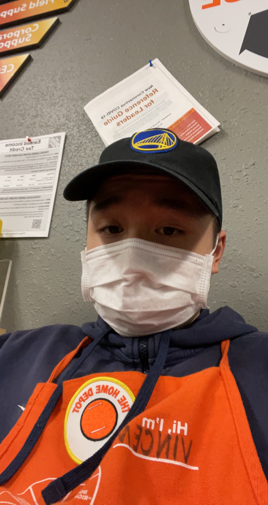
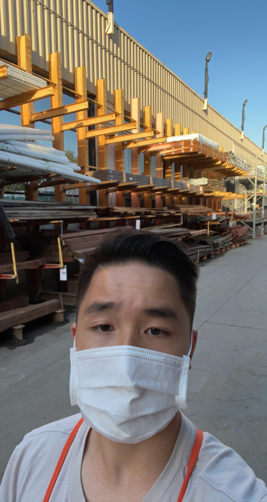
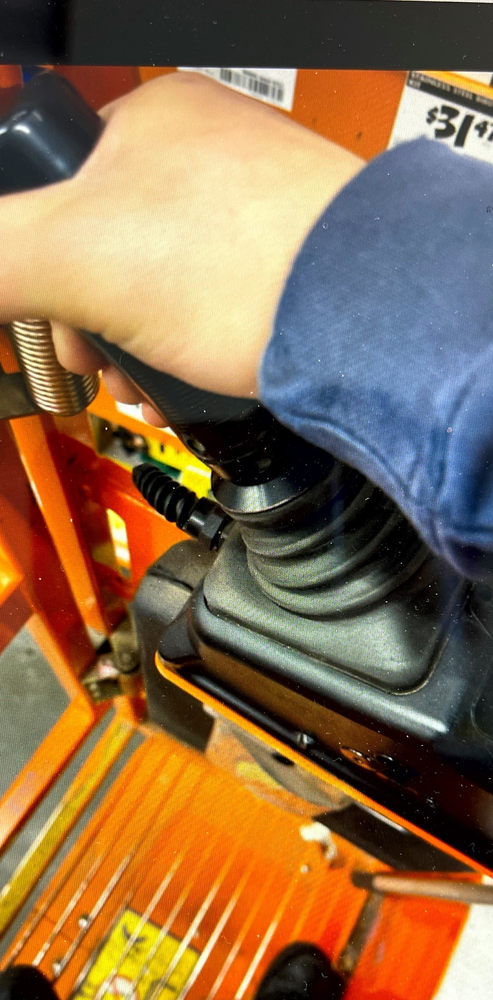

<!DOCTYPE html>
<html lang="en">

<head>

  <meta charset='UTF-8'>
  <meta name="viewport" content="width=device-width, initial-scale=1, shrink-to-fit=no">
  <link rel="shortcut icon" href="img/hnet.com-image.ico">
  <meta name="description" content="Vincent's Resume">
  <meta name="author" content="862316303">

  <title>Vincent Vu - Business Administration</title>

  <!-- Bootstrap core CSS -->
  <link href="vendor/bootstrap/css/bootstrap.min.css" rel="stylesheet">

  <!-- Custom fonts for this template -->
  <link href="https://fonts.googleapis.com/css?family=Saira+Extra+Condensed:500,700" rel="stylesheet">
  <link href="https://fonts.googleapis.com/css?family=Muli:400,400i,800,800i" rel="stylesheet">
  <link href="vendor/fontawesome-free/css/all.min.css" rel="stylesheet">

  <!-- Custom styles for this template -->
  <link href="css/resume.min.css" rel="stylesheet">

</head>

<body id="page-top">
  <nav class="navbar navbar-expand-lg navbar-dark bg-primary fixed-top" id="sideNav">
    <a class="navbar-brand js-scroll-trigger" href="#page-top">
      Vincent Vu
      
        
    </a>
    <button class="navbar-toggler" type="button" data-toggle="collapse" data-target="#navbarSupportedContent" aria-controls="navbarSupportedContent" aria-expanded="false" aria-label="Toggle navigation">
      
    </button>
    

      <ul class="navbar-nav">
        <li class="nav-item">
          <a class="nav-link js-scroll-trigger" href="#about">About</a>
        </li>
        <li class="nav-item">
          <a class="nav-link js-scroll-trigger" href="#experience">Experience</a>
        </li>
        <li class="nav-item">
          <a class="nav-link js-scroll-trigger" href="#education">Education</a>
        </li>
        <li class="nav-item">
          <a class="nav-link js-scroll-trigger" href="#portfolio">Portfolio</a>
        </li>
      </ul>
    

  

  </nav>

  

    <section class="resume-section p-3 p-lg-5 d-flex align-items-center" id="about">
      

        <h1 class="mb-3">Vincent Vu
        </h1>
        
Business Administration

        
I am a business student at the University of California, Riverside.  

        While studying to get a degree from Milpitas High School, I worked within two Fortune 500 companies – Home Depot and Burlington – and tutored middle school students.  

At Home Depot, I was a sales associate. My responsibilities would be to help direct customers with their needs and make sure the store shelves were looking tidy and presentable. To help direct customers to the items that they wanted, I used my excellent customer service skills and extensive knowledge of the item's location in the store. There are a lot of tools and items that are sold at Home Depot that I didn’t personally know about when I got there. I studied all of the manuels given to me on my first day and asked other employees on the floor about how things worked. I did this because I wanted to be able to give suggestions to customers on what to buy to help their problems.
  

        At Burlington, I worked as a cashier and a sales associate. My responsibilities as a cashier was to greet the customers, work the register, answer any of their questions, and bag all the purchased materials. Being behind the register helped me develop my customer service skills and taught me how to operate a cash register. Since every store has a cash register, having the knowledge to operate one is very helpful because it makes my skill more valuable. My responsibilities as a sales associate were to straighten up the clothing racks and help out any customers that had questions. This involved a lot of memorization of the store because most of the questions were about where a certain product is. I would switch between both of these positions whenever it was needed. If the check out lines were getting too long, I would open up a cash register and start processing their payments. If there was a giant pile of clothes on the floor, I was responsible for cleaning it up.  

At Rancho Milpitas Middle School, I tutored students on what they were learning. After I was done with my classes in high school, I would go back to my old middle school and tutor around 10 kids twice a week every week. The sessions were every Tuesday and Thursdays with them being an hour each. I would walk around the classroom while the students were working and help them with what they needed. If a majority of the students were struggling on the same problem, I would teach them how to do it on the whiteboard. Even though the work given was meant for middle school students, it was still good to refresh my memory and knowledge on all the academic subjects.  

I’m currently working on my bachelor’s degree in business administration at the University of California, Riverside. I’m planning to specialize in management after I finish my two years of general education. The ultimate goal of my life is to one day own and manage my own successful business.

        

        

          <a target="_blank" id="socialicon-1" href="https://www.linkedin.com/in/vincent-vu-2b30a3231/">
            <i class="fab fa-linkedin-in"></i>
          </a>
          <a target="_blank" id="socialicon-2" href="https://github.com/VincentVu123">
            <i class="fab fa-github"></i>
          </a>
          <a target="_blank" id="socialicon-3" href="https://twitter.com/VincentVu17">
            <i class="fab fa-twitter"></i>
          </a>
          <a target="_blank" id="socialicon-4" href="mailto:vincentvu01171@gmail.com">
            <i class="fa fa-envelope"></i>
          </a>
        

      

    </section>

    

    <section class="resume-section p-3 p-lg-5 d-flex justify-content-center" id="experience">
      

        <h2 class="mb-5">Experience</h2>

        

          

            <h3 class="mb-0">Sales Associate</h3>
            
<a target="_blank" href="https://yourcompany.com">Home Depot</a>

            

              • Help direct customers to their needs  
              • Restocking and straightening the shelves 
              • Experience with customer service 
            

          

          

            January 2021 - August 2021
          

        

        

          

            <h3 class="mb-0">Cashier</h3>
            
<a target="_blank" href="https://wholefoods.com">Burlington</a>

            

              • Responsible for checking out customers 
              • Promoted the store's credit card 
              • Experience with cash registers 
            

          

          

            June 2020 - December 2020
          

        

        

          

            <h3 class="mb-0">Tutor</h3>
            
<a target="_blank" href="https://ucr.edu">Rancho Milpitas Middle School</a>

            

            • Ran sessions to help students with their homework 
            • Reviewed and graded student's work 
            • Answered questions students had with what they were learning 
            • Tutored over 20 students every academic semester 
          

          

          

            October 2017 - May 2020
          

        

      

    </section>

    

    <section class="resume-section p-3 p-lg-5 d-flex align-items-center" id="education">
      

        <h2 class="mb-5">Education</h2>

        

          

            <h3 class="mb-0">University of California Riverside</h3>
            
Business Administration

            
Bachelor's Degree in Business Management

          

          

            September 2021 - Present
          

        

        

          

            <h3 class="mb-0">Milpitas High School</h3>
            
Postgraduate Certificate in High School Education

            
High School Degree

          

          

            August 2017 - June 2021
          

        

      

    </section>

    

    <section class="resume-section p-1 p-lg-5 d-flex align-items-center" id="portfolio">
      

        <h2 class="mb-5">Portfolio</h1>
      

    
     
    
     
       

      

    </section>

    

    
&copy;  Vincent Vu
 
  

  <!-- Bootstrap core JavaScript -->
  
  

  <!-- Plugin JavaScript -->
  

  <!-- Custom scripts for this template -->
  
</body>
</html>
